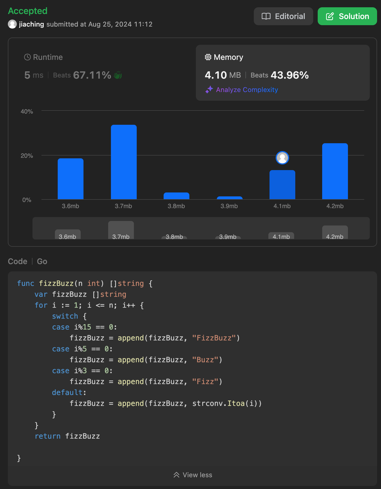

### 目標:

撰寫 FizzBuzz 程式

### 要求:

首先，撰寫可列印數字 1 到 100 的程式，並進行下列變更：

- 如果數字可由 3 整除，則列印 Fizz。
- 如果數字可由 5 整除，則列印 Buzz。
- 如果數字可由 3 和 5 整除，則列印 FizzBuzz。
- 如不符合以上結果，則列印數字。
- 嘗試使用 switch 陳述式。

### 執行結果輸出
**正常**
```
[1 2 Fizz 4 Buzz Fizz 7 8 Fizz Buzz 11 Fizz 13 14 FizzBuzz 16 17 Fizz 19 Buzz Fizz 22 23 Fizz Buzz 26 Fizz 28 29 FizzBuzz 31 32 Fizz 34 Buzz Fizz 37 38 Fizz Buzz 41 Fizz 43 44 FizzBuzz 46 47 Fizz 49 Buzz Fizz 52 53 Fizz Buzz 56 Fizz 58 59 FizzBuzz 61 62 Fizz 64 Buzz Fizz 67 68 Fizz Buzz 71 Fizz 73 74 FizzBuzz 76 77 Fizz 79 Buzz Fizz 82 83 Fizz Buzz 86 Fizz 88 89 FizzBuzz 91 92 Fizz 94 Buzz Fizz 97 98 Fizz Buzz]
```


